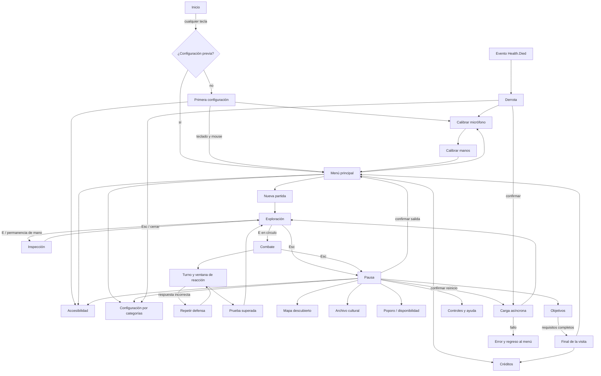

# Auditoría y navegación

Inspección realizada antes de editar código. Fecha: 13–14 de septiembre de 2026.

## Proyecto encontrado

| Área | Evidencia y decisión |
|---|---|
| Unity | `ProjectSettings/ProjectVersion.txt`: 6000.3.21f1 |
| Render | URP 17.3.0; assets PC/Mobile existentes; se conserva la selección del proyecto |
| Entrada | Input System 1.20.0; `activeInputHandler: 1`; teclado y mouse directos en los controladores |
| UI | uGUI 2.0; `TechnicalDemoHUD` genera Canvas a 1440 × 900 y usa Text heredado |
| Resolución inicial | 1024 × 768; cambiada exclusivamente a 1920 × 1080 para la entrega |
| Escena del slice | `TechnicalDemo_Week08`, primera escena habilitada en Build Settings |
| Otras escenas | Scene, Movement y Hand Landmark Detection aditiva; conservadas |
| Movimiento | PlayerController: caminar, correr, salto, dash, bloqueo de entrada y teletransporte |
| Cámara | ExplorationOrbitCamera: órbita con botón derecho y colisiones |
| Vida | Health expone HealthChanged y Died |
| Combate | PlazaCombatModel: tres ataques, esquiva, bloqueo, telegraph/reaction/feedback; errores repiten la defensa |
| Inspección | TechnicalDemoController, InspectionModel y PlazaLessonModel miden giro y congelación |
| Cultura | Tres AnalyzableObjectData clasificados ArtisticInterpretation; descripciones existentes conservadas |
| Manos | MediaPipe 0.16.3; PlazaHandSession carga la escena explícitamente; HandGestureTracker consume landmarks |
| Voz | VoiceCommandRecognizer existente reconocía esquiva/dodge y solo se conectaba al jefe de Movement |
| Audio | PlazaAudio y 16 clips locales; efectos y ambiente separados |
| Progresión | Tres estaciones y duelo abren los portales; mundo inferior/superior son umbrales explorables |
| Ausentes | Guardado persistente, checkpoints, inventario consumible del poporo, secuencia narrativa de diálogos |

Había numerosos cambios locales antes de esta tarea. No se revirtieron. `TechnicalDemoHUD` se conserva; la raíz nueva desactiva únicamente esa presentación cuando encuentra un TechnicalDemoController válido. Movement conserva su UI anterior. No se borraron escenas ni se cambió el orden de build.

El log previo mostraba advertencias de captura MediaPipe. La prueba limpia encontró además `point`, identificador reservado de HLSL, en PortalVeil.shader. Se renombró a `localPoint` para permitir compilar Windows, sin alterar el efecto. Es la única corrección visual ajena a la UI.

## Mapa de pantallas



Volver restaura el panel previo y su foco. Los modales seleccionan Cancelar por defecto y bloquean las acciones del panel inferior. Escape durante el duelo abre pausa; durante inspección conserva la cancelación de inspección. R solicita confirmación. Tab abre mapa en exploración y navega controles dentro de menús.

## Wireframes de composición

```text
MENÚ / CONSULTAS                   EXPLORACIÓN
┌──────────────────────────────┐  ┌──────────────────────────────┐
│  Título     escena existente │  │ Vida     Zona      Disposit. │
│  ─────────                  │  │ Objetivo                     │
│  Acción principal           │  │         Aviso temporal       │
│  Lista / lectura            │  │                              │
│  con desplazamiento         │  │       Mundo y personaje      │
│                             │  │                              │
│  Volver      teclas de ayuda │  │      Interacción contextual  │
└──────────────────────────────┘  └──────────────────────────────┘

INSPECCIÓN                         COMBATE
┌──────────────────────────────┐  ┌──────────────────────────────┐
│ Vida                         │  │ Vida      Turno / guardián   │
│                    Nombre    │  │                    Mensaje   │
│                    Instrucc. │  │                    Acciones  │
│ Modelo existente   Contexto  │  │  Personaje/enemigo  válidas   │
│ giro / zoom        cultural  │  │                              │
│                    Progreso  │  │                    Tiempo    │
│                    Cerrar    │  │                    Regresar  │
└──────────────────────────────┘  └──────────────────────────────┘
```

El archivo solo expone piezas completadas. El mapa registra posiciones recorridas y elementos conocidos; no consulta geometría oculta para dibujarla. Las rutas de cada mundo se almacenan por separado durante la sesión.
