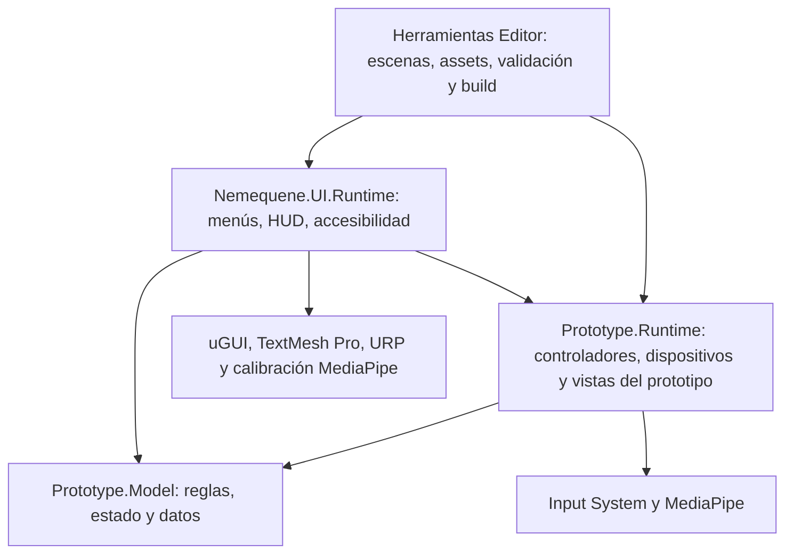

# Revisión de arquitectura y build

Fecha: 15 de septiembre de 2026. Unity 6000.3.21f1. Plataforma: Windows x64.

## Estructura



- **Model** conserva habilidades, inspección, combate, gestos, objetivos y lecciones. No depende de la interfaz ni de los controladores. Usa matemáticas de Unity; `Health` es un componente y las configuraciones son `ScriptableObject`, por lo que no es una biblioteca completamente independiente del motor.
- **Runtime** adapta esas reglas a personajes, cámaras, colisiones y dispositivos. Las vistas del prototipo anterior permanecen aquí porque comparten controladores; la interfaz nueva está separada.
- **UI** contiene el menú independiente, la presentación de la plaza y los ajustes. Consulta el juego y sus eventos. El juego no referencia este módulo.
- Los nuevos archivos `.asmdef` hacen cumplir estos límites al compilar. Las herramientas de las carpetas `Editor` quedan fuera del ejecutable. Los tests tienen sus propios ensamblados.
- Se conservaron los GUID de los scripts y se actualizaron los identificadores de ensamblado de los assets serializados.

## Ciclo de vida y escenas

`Nemequene_MainMenu` inicia la aplicación. `Nueva partida` carga `TechnicalDemo_Week08`. El cargador de `UIManager` crea la interfaz de esa escena; al salir libera sus suscripciones y restaura la pausa y la configuración temporal del renderizado.

La escena aditiva `Hand Landmark Detection` continúa incluida: la necesitan las sesiones de manos. La plaza la solicita al activar la cámara; `Movement` conserva su arranque anterior. Cámara y voz siguen siendo opcionales en la plaza. Los modelos no reciben objetos del plugin: los adaptadores convierten entradas a comandos y coordenadas.

Se mantienen las escenas anteriores en la build para conservar el acceso al prototipo. No se han implementado guardado, mundos completos ni una nueva capa de servicios: el alcance sigue siendo el prototipo actual.

## Problemas corregidos

| Problema | Resultado |
| --- | --- |
| Seleccionar repetidamente la pestaña activa duplicaba el historial de navegación. | `Replace` conserva el historial sin copiarlo; `Back` consume una entrada. |
| Un objeto seleccionado sin componente `Selectable` podía fallar al restaurar el foco. | La navegación comprueba el componente y busca otro control interactivo. |
| La marca de una muerte anterior se arrastraba a una caída posterior. | Cada caída distingue si su propio daño causó la muerte y vuelve al punto adecuado. |
| Desactivar un objeto durante la inspección dejaba bloqueado al jugador y desactivada su cámara. | `OnDisable` termina la inspección y restaura el estado previo de la cámara. La recompensa no puede concederse dos veces. |
| Una resolución aún sin confirmar podía quedar activa al destruir la interfaz. | El controlador de carga revierte la previsualización durante su limpieza. |

## Validación antes de compilar

`ProjectBuildValidation` se ejecuta automáticamente antes de cada build. Comprueba la dirección de dependencias de los tres módulos, el orden y la presencia de las escenas requeridas, los scripts de las escenas y prefabs del proyecto, y las referencias de la interfaz y sus fuentes. También puede ejecutarse desde **Tools → Nemequene → Validate project structure**.

Las pruebas se ejecutan en `Builds/UIValidationProject`, una copia de validación con sus propios archivos de Unity, para no interferir con el proyecto abierto. Se sincronizan los cambios de `Assets`, y los cambios de paquetes o configuración cuando existan. Las compilaciones se generan desde esa copia y se copian a `Builds/Nemequene`.

Comandos de Unity utilizados (añadir `-batchmode -projectPath <proyecto> -logFile <log>`):

```text
-runTests -testPlatform EditMode -testResults <resultados.xml>
-runTests -testPlatform PlayMode -assemblyNames Prototype.Tests.PlayMode -testResults <resultados.xml>
-executeMethod Nemequene.UI.Editor.UIValidation.Run
-executeMethod Nemequene.UI.Editor.TitleMenuValidation.Run
-executeMethod Nemequene.UI.Editor.UIAssetBuilder.WindowsBuild
```

La build actual es **Development**, útil para seguir probando el prototipo. Su comprobación automatizada se activa con `--nemequene-ui-smoke`; recorre inicio, configuración, nueva partida, pausa y regreso al título. Para distribuirla hay que conservar la carpeta completa, no solo el `.exe`.

Las pruebas automáticas comprueban reglas, componentes reales y flujos de interfaz. El reconocimiento real de voz y cámara requiere una sesión interactiva con esos dispositivos; no queda certificado por la ejecución en batch.

## Resultados de esta revisión

Los resultados finales y los informes se conservan en `Specs/Architecture/`.
