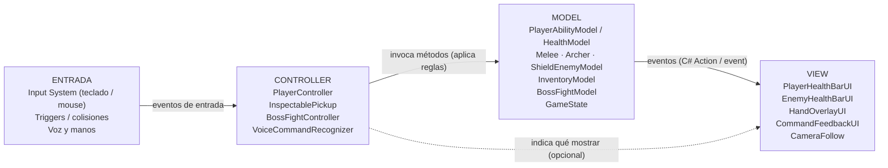

# Arquitectura: Entrada → Controller → Model → View

Fecha: 8 de octubre de 2026. El Controller lee la entrada y ordena al Model; el Model notifica
por eventos y la View solo renderiza.

## Las cuatro capas en el código

| Capa | Dónde | Qué hace | No hace |
| --- | --- | --- | --- |
| Entrada | Input System, `GameBindings`, `OnTrigger*` / `OnCollision*`, MediaPipe y reconocedor de voz | Produce eventos crudos | Decidir nada |
| Controller | `Assets/_Game/Scripts/Controller` (ensamblado `Prototype.Runtime`) | Lee la entrada, llama a los métodos del Model, guarda la partida, carga escenas y crea las vistas | Contener reglas que puedan vivir en un modelo puro |
| Model | `Assets/_Game/Scripts/Model` (ensamblado `Prototype.Model`) | Reglas y estado en C# puro; avisa con `event Action` | Tocar escenas, `GameObject`, `MonoBehaviour` o la entrada |
| View | `Assets/_Game/Scripts/View` (también `Prototype.Runtime`) y `Assets/_Game/UI` (menús) | Barras, HUD, textos, cámara, brillos, partículas, animación y sonido | Leer la entrada o cambiar el estado del juego |

El ensamblado `Prototype.Model` no referencia a `Prototype.Runtime`, así que el compilador impide
que un modelo dependa de un controlador o de una vista.

## Correspondencia con el diagrama

| Caja del diagrama | Clase real |
| --- | --- |
| PlayerModel / HealthModel | `PlayerAbilityModel` (doble salto e impulso) y `HealthModel` (vida, invulnerabilidad, muerte). El componente `Health` (Controller) aloja un `HealthModel` por personaje. |
| EnemyModel | `MeleeModel`, `ArcherModel`, `ShieldEnemyModel` y, en los duelos, `TurnDuelModel` con sus `DuelRules` |
| InventoryModel | `InventoryModel`: hallazgos de cada mundo. `MIProgress` y `MSProgress` (Controller) solo lo guardan en la ranura; `WorldInventoryRules` deriva de él las habilidades y el daño |
| BossFightModel | `BossFightModel` (y `TurnDuelModel` para los duelos por turnos) |
| GameState | `GameState`: exploración, análisis, combate o transición. Lo usa `TechnicalDemoController`. La campaña completa vive en `CampaignModel` |
| PlayerController, InspectablePickup, BossFightController, VoiceCommandRecognizer | Mismos nombres, en `Controller/`. Más controladores de escena: `TurnDuelController`, `PlazaCombatController`, `MundoInferiorBlockout`, `MundoSuperiorDirector`, `StoryPlayer`… |
| PlayerHealthBarUI, EnemyHealthBarUI, HandOverlayUI, CommandFeedbackUI, CameraFollow | Mismos nombres, en `View/`. Más: `TurnDuelHUD`, `MIHud`, `StoryDialogueView`, `DuelGlow`, `DuelSignalCues`, `GameAudio`… |

## Flujo de un golpe

1. **Entrada:** la colisión de una flecha llega a `ArrowProjectile.OnTriggerEnter`.
2. **Controller:** `Health.TakeDamage(amount)` pasa el reloj del juego al modelo.
3. **Model:** `HealthModel.TakeDamage` aplica la invulnerabilidad, resta la vida y lanza `Changed`, y `Died` si llega a cero.
4. **View:** `PlayerHealthBarUI` y `EnemyHealthBarUI` están suscritas a esos eventos y solo redibujan.

## Reglas que comprueban las pruebas

`Tests/EditMode/ArchitectureTests.cs` falla si alguna se rompe:

- Ningún archivo de `Model` es `MonoBehaviour`, toca la escena (`GameObject`, `Transform`, `Renderer`, `Camera.main`, `Find…`) ni lee la entrada.
- Ningún archivo de `View` lee teclado, ratón, mando ni `GameBindings.Pressed`/`Held`.
- Ningún archivo de `View` cambia el estado (`TakeDamage`, `Heal`, `Revive`, `…Progress.Set`).
- Los modelos del diagrama existen y los que notifican tienen eventos.

## Cambios del 8 de octubre de 2026

- `Health` dejó de ser un `MonoBehaviour` dentro de Model: las reglas pasaron a `HealthModel` y el componente se movió a Controller. Se conservó el GUID, así que escenas y prefabs no cambian.
- Se crearon `InventoryModel` y `WorldInventoryRules`, que sacan de `MIProgress` y `MSProgress` el conjunto de hallazgos y sus reglas.
- `GameState` (Model) sustituye al enum suelto del controlador de la plaza.
- Se movieron a `View/` 23 componentes que solo presentan, todos con su GUID: `CameraFollow`, `CreatureFlight`, la cámara, la animación, los brillos, las señales y el sonido de los duelos, el audio completo, las partículas y los brillos de los mundos, y los jardines.
- La tecla de ayuda de la plaza la lee `TechnicalDemoController`; el panel (`TechnicalDemoHUD`) escucha `HelpChanged`. El menú de capítulos (F9), que solo existe en builds de desarrollo, pasó a Controller.
- `MIHud` ya no consulta el duelo en cada fotograma: escucha `TurnDuelController.RunningChanged`.

## Excepciones aceptadas

- `TechnicalDemoConfig` y `AnalyzableObjectData` son `ScriptableObject` de datos (configuración editable en el inspector), sin comportamiento.
- Los modelos usan los tipos matemáticos de Unity (`Vector2`, `Vector3`, `Mathf`) y `JsonUtility` para leer datos. No dependen de la escena.
- Algunas vistas observan el estado de su controlador sin cambiarlo: `PlayerAnimator` lee la velocidad del `PlayerController` y `MIHud` escucha el inicio y el fin del duelo. Es la flecha discontinua del diagrama.
- El ensamblado de menús `Nemequene.UI` tiene sus propios `*UIController`: leen la entrada de los menús y presentan las pantallas, como un MVC propio de la interfaz.
