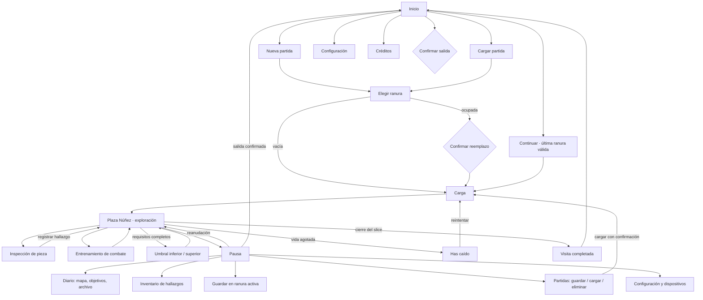

# Diseño integral de interfaz · El asedio de Bacatá

Este documento convierte el sistema entregado por el usuario en un mapa de pantallas y decisiones para el juego real. El archivo de origen es `El_Asedio_de_Bacata_UI_Design_System.md`; la composición y materialidad toman como referencia la imagen `Referencia-visual-proporcionada.png` facilitada después. Esa imagen es una referencia estética, no una lista de sistemas implementados ni evidencia histórica. Los ejemplos de contenido de jefe, sigilo y narrativa son patrones de diseño, no contenido ya presente en el vertical slice.

## Revisión · referencias de UI, bloques 1–4 (29 de septiembre de 2026)

Las cuatro láminas «Referencia de UI» entregadas por el usuario (UI base, HUD, gameplay y narrativa, pantallas especiales) se integran como **estética**, no como lista de sistemas. Consumibles, sigilo, minimapa, maná, jefe con retrato y elecciones de diálogo siguen sin mecánica y no se simulan; sus contratos visuales están más abajo. Esta sección sustituye la tabla de tokens anterior cuando entren en conflicto.

### Paleta y roles de texto

Definida en `UITheme` / `UIPalette` (`Assets/Prototype/Scripts/View/UIKit/UITheme.cs`) y en `Resources/Nemequene/Theme.asset`. Cada par texto/superficie se midió con la fórmula WCAG; la superficie de piedra es el color medio real del centro de `StonePanel-v2.png` (`#2C1F17`) y el HUD se mide sobre el peor caso (velo al 86 % sobre blanco, `#373431`).

| Rol | Color | Superficie | Contraste |
|---|---|---|---|
| Oro Muisca (bordes, iconos) | `#D4A342` | piedra | 6,9:1 |
| Títulos (Cinzel) | `#E6B85C` | piedra / HUD | 8,6:1 / 6,7:1 |
| Dorado claro (teclas, énfasis) | `#F4D18C` | piedra | 10,9:1 |
| Texto principal (marfil) | `#EFE3C8` | piedra / HUD / punto claro de la piedra | 12,5:1 / 9,7:1 / 6,1:1 |
| Texto secundario | `#C9B89A` | piedra / HUD | 8,2:1 / 6,4:1 |
| Tinta sobre pergamino | `#2A1D12` | pergamino `#EED2A9` | 11,3:1 |
| Tinta secundaria | `#5A4228` | pergamino | 6,4:1 |
| Texto sobre botón dorado | `#1E140A` | oro `#F2C96E`→`#B8862F` | 11,5:1 → 5,6:1 |
| Texto sobre rojo ceremonial | `#F3E6CC` | `#A63A30`→`#6E1F1B` | 5,2:1 → 9,1:1 |
| Cifra sobre barra de vida | `#EFE3C8` | `#A3322A` | 5,4:1 |
| Texto desactivado | `#A99F8E` | placa `#2A241E` | 5,9:1 (antes 3,6:1) |
| Título de derrota | `#E4604F` | piedra teñida de rojo | 5,1:1 (solo títulos grandes) |

Correcciones de contraste respecto al estado anterior: el nombre de zona, el aviso «Cámara activa» y la leyenda del cursor de manos se dibujaban directamente sobre el mundo (la plaza es crema, sin contraste garantizado); ahora tienen placa HUD. El texto desactivado pasa de 3,6:1 a 5,9:1. Las UIs del prototipo (escena Movement) usaban Arial blanco con sombra sobre el mundo; ahora usan las mismas placas.

### Tipografía

- **Cinzel** (SIL OFL, `Fonts/Cinzel.ttf`, licencia en `Fonts/OFL-Cinzel.txt`): títulos de pantalla, secciones, nombre de zona, turno, hablante y rótulos cortos, siempre en mayúsculas con espaciado 2–4. Atlas TMP dinámico generado por `UIDisplayFontSetup` (se ejecuta una vez al importar; menú *Tools/Nemequene/UI/Build display font (Cinzel)*), con Noto Serif como respaldo de glifos.
- **Noto Serif**: lectura y botones. **Noto Sans**: opción «Tipografía de alta legibilidad», que también sustituye a Cinzel.
- Los títulos largos se reducen (autoajuste, mínimo 60 %) antes de invadir el contenido; las etiquetas de cajas HUD fijas se reducen en lugar de saltar de línea al 150 %.

### Componentes nuevos

| Componente | Uso |
|---|---|
| `UIPlateGraphic` | Placa biselada vectorial: primario (oro con tinta oscura), secundario (piedra oscura con filo dorado), peligro (rojo ceremonial), desactivado, riel de barra y tecla. Foco = filo claro + halo + rombo. |
| `UIIconGraphic` | Iconos vectoriales originales: rombo, sol con «!», sol radiante, corazón, espada, escudo, esquiva, reloj de arena, portal, máscara, divisor ornamental. Siempre acompañan texto. |
| `UIKeyHint` | Convierte «E · Examinar» y «Atacar · E» en tecla tallada + acción (prompts, combate, Volver · Esc, Continuar · Enter). |
| `UIFactory.Heading / Caption / Divider / KeyCap / Icon / Row` | Títulos Cinzel con divisor, rótulos, teclas y filas. `Bar` ahora es riel tallado con relleno y brillo. `Slider` = riel + relleno dorado + perilla. |
| `UIKit` (Prototype) | Espejo mínimo de la fábrica para la escena Movement (vida, alertas, turno del jefe, voz, manos). |

### Disposición (referencia 1920 × 1080)

Márgenes de pantalla del 5 % horizontal y 4 % vertical. Ninguna superficie de exploración comparte espacio con otra:

| Superficie | Anchors | Notas |
|---|---|---|
| Vida | (.05,.865)–(.27,.955) | Corazón, «VIDA», cifra dentro de la barra. Visible con daño o en combate. |
| Objetivo | (.05,.80)–(.34,.955) | Rombo + «OBJETIVO ACTUAL». Excluyente con Vida. |
| Nombre de zona | (.33,.845)–(.67,.955) | Cinzel 44 + divisor, 3 s. |
| Estado de cámara | (.74,.895)–(.95,.955) | Solo con cámara activa. |
| Aviso (toast) | (.66,.765)–(.95,.875) | Crece hacia abajo con el tamaño de texto. |
| Tutorial | (.68,.40)–(.95,.73) | Pergamino; solo en exploración. |
| Interacción | (.33,.05)–(.67,.15) | Tecla + acción. Se oculta con subtítulos. |
| Turno de combate | (.33,.80)–(.67,.955) | Turno + barra segmentada del guardián (3 golpes). |
| Acciones de combate / Inspección | columna derecha (.65–.95) | Márgenes internos de 60 px (80 bajo la cresta) para no pisar el marco tallado. |

Los botones «Volver» se colocan 64 px sobre el borde inferior del panel; la navegación lateral de Configuración y Diario ocupa (.045–.30) del panel y el contenido (.33–.955).

### Pantallas especiales

- **Has caído**: velo rojo oscuro uniforme, piedra teñida de rojo, máscara, título Cinzel rojo, una frase y acciones centradas (Reiniciar en oro).
- **Visita completada**: sol radiante, tabla con tiempo de la visita, estaciones activadas, zonas visitadas y entrenamiento (solo valores que el slice registra).
- **Confirmación**: pergamino, sol con «!», pregunta y consecuencia separadas, Cancelar (foco inicial) y acción lado a lado; las destructivas en rojo.
- **Carga**: estado en Cinzel, riel dorado y consejo.
- **Diálogo**: placa de hablante sobre el borde del pergamino.

### Contratos visuales pendientes de mecánica

Barra de jefe con retrato, indicador de sigilo (Oculto / Sospecha / Detectado), minimapa, recurso/energía y ranuras rápidas reutilizan `Bar`, `UIPlateGraphic`, `UIIconGraphic` y el HUD compacto sin nuevos estilos cuando exista el sistema que los alimente.

### Verificación

Capturas generadas en una copia del proyecto mediante una prueba de PlayMode en batch (1080p, 720p al 150 %, alto contraste), con auditoría automática de texto que desborda su caja; la selección está en `Specs/UI/Evidence-2026-09-29/`. No se modificaron escenas ni prefabs serializados: los campos de color y margen del prototipo se renombraron para que los valores antiguos guardados en `Movement.unity` y en los prefabs de enemigos dejen de aplicarse.

## Dirección y tokens vigentes

La UI se construye como piedra tallada, pergamino y metal gastado: marcos escalonados, filetes de oro envejecido, una muesca central y rombos pequeños para foco. El centro de cada panel deja contraste suficiente para leer; los bordes llevan la mayor textura. No se adjudica significado arqueológico a los motivos geométricos. La ilustración del inicio y el mundo 3D aportan la atmósfera.

La implementación usa dos sprites nuevos con esquinas transparentes y bordes configurados para nueve cortes: `StonePanel-v2.png` para ventanas y tarjetas, y `ParchmentPanel-v2.png` para mapa, diálogo y tutorial. `Menu_StoneButton.png` viste las acciones principales. `Menu_BacataDawn-v2.png` crea una portada cálida con el espacio de lectura a la izquierda y el personaje a la derecha; el emblema y las placas permanecen como capas independientes. `UIFrameGraphic` y `UIArtifactGlyph` añaden marcos e iconos vectoriales reproducibles. El modo de alto contraste sustituye las texturas por superficies oscuras y marco limpio. El HUD usa una superficie semitransparente y un marco compacto para no tapar el mundo. La imagen de referencia no se usa directamente como interfaz ni como fondo de juego.

| Función | Color | Regla |
|---|---|---|
| Fondo profundo | `#16130F` | Velo, carga y áreas sin imagen. |
| Fondo secundario | `#241B14` | Separación de zonas. |
| Panel | `#312219` | Lectura y controles. |
| Elevación | `#473225` | Foco secundario o selección persistente. |
| Carbón | `#0E0C09` | Borde exterior. |
| Oro / oro solar | `#B88A47` / `#D0A45B` | Borde, foco y acción principal. |
| Hueso / pergamino | `#E8D8B8` / `#CBB894` | Texto principal y auxiliar. |
| Ceniza | `#84796A` | Inactivo con explicación textual. |
| Musgo / verde mineral | `#596147` / `#667653` | Terreno y éxito. |
| Ocre | `#C28A3E` | Advertencia. |
| Terracota / sangre seca | `#9B463A` / `#713128` | Error y destrucción confirmada. |

Noto Serif es la voz ceremonial y la lectura ordinaria de esta revisión. Noto Sans queda disponible mediante «Tipografía de alta legibilidad». Se conservan los atlas TMP con español. La escala de referencia es 1920 × 1080, con Canvas Scaler 0,5, márgenes mínimos de 64 px horizontales y 48 px verticales. El contenido crítico ocupa el 90 % central. Espaciado: 8, 16, 24, 32, 48, 64 y 96 px. Títulos de pantalla 48–64 px, acciones 26–36 px, lectura 24–28 px. Se comprueba 1280 × 720, 1920 × 1200 y texto de 150 %.

## Flujo completo

El guardado actual tiene tres ranuras y un punto seguro: **Plaza Núñez**. Restaura las tres lecciones, el duelo, los mundos visitados y el tiempo jugado; inicia en la plaza para evitar reaparecer dentro de un portal, una inspección o un turno de combate. «Continuar» elige la ranura válida más reciente. Una ranura ilegible muestra «No se puede leer» y permite eliminarla; nunca se carga a ciegas. Nueva partida y eliminación piden confirmación cuando afectan datos existentes. Cargar durante el juego advierte sobre cambios no guardados. La pausa ofrece guardado rápido en la ranura activa y la gestión de ranuras.

## Pantallas y estados

| Pantalla / superficie | Jerarquía de diseño | Navegación y estados |
|---|---|---|
| Inicio | Emblema en la mitad superior, seis placas en una columna lateral y paisaje cálido con personaje a la derecha. | Continuar desactivado si no hay ranura válida; foco inicial en Continuar o Nueva partida. Escape pide salir. |
| Nueva partida / cargar | Título, tres ranuras con punto, avance, tiempo y fecha; acciones según contexto; volver. | Vacía, ocupada, corrupta y seleccionada. Reemplazo y eliminación abren confirmación con Cancelar enfocado. |
| Carga | Nombre de la plaza, estado, trazo de progreso y recuperación ante error. | Sin botones inoperantes; si falla, aparece Volver. |
| Exploración | Mundo libre de controles permanentes; vida tras daño, objetivo al cambiar, interacción por proximidad. | Tab abre diario, H controles, Esc pausa. Voz y cámara son opcionales. |
| Inspección | Pieza grande en escena; placa lateral con nombre, instrucción del método activo, progreso y salida. | Mouse o manos; error de seguimiento ofrece mouse. La rueda acerca; Esc conserva progreso parcial de la sesión. |
| Combate | Vida, guardián, fase, señal, acciones válidas y tiempo. | Ataque en turno propio; esquiva y bloqueo en reacción. Un fallo técnico de voz permite repetir sin castigo. |
| Pausa | Escena atenuada, título, continuar, diario, inventario, guardado, partidas, configuración y salida. | Reanudar primero. La pausa conserva el estado anterior y devuelve el foco. |
| Partidas dentro del juego | Tres tarjetas verticales con Guardar, Cargar y Eliminar. | Carga y reemplazo confirman; ranuras vacías desactivan Cargar y Eliminar. |
| Diario / objetivos | Navegación lateral Mapa, Recorrido y Archivo; contenido desplazable. | Activo, completado y bloqueado con texto más marcador. La acción Finalizar aparece solo con los requisitos completos. |
| Mapa | Ruta conocida, jugador, señales descubiertas, leyenda textual. | No revela geometría sin explorar; la posición del jugador se diferencia por tamaño y color. |
| Archivo cultural | Piezas descubiertas, nombre y descripción clasificada como interpretación artística. | Una pieza desconocida no afirma datos históricos. |
| Inventario | Cuadrícula de nueve espacios y panel de detalle con glifo ampliado. | Las lecciones completadas producen hallazgos ×1. Los espacios no obtenidos indican «Por descubrir» o «Bloqueado». No hay consumo ficticio. |
| Tutorial contextual | Tarjeta de pergamino con una instrucción y acción «Entendido», en la parte derecha. | Aparece al comenzar, se descarta al avanzar o al pulsar «Entendido» y se oculta cuando otra pantalla toma el foco. |
| Configuración | Pestañas laterales, valores textuales, cuerpo desplazable, Volver estable. | Accesibilidad abre primero. Mouse, teclado y mando usan el mismo foco visible. |
| Audio | Volúmenes general, menú, efectos, ambiente e interfaz con número. | Cada cambio se aplica y persiste. |
| Vídeo | Resolución con vista previa reversible, pantalla completa, calidad, VSync, FPS y antialiasing. | La resolución se restaura tras 15 s sin confirmar. |
| Voz y manos | Estado textual, dispositivo, sensibilidad, medidor, prueba y alternativa. | Ningún dispositivo es obligatorio. Desconexión muestra acción recuperable. |
| Subtítulos / diálogo | Banda inferior de 1–2 líneas, hablante opcional; diálogo con nombre y avance. | Tamaño y fondo configurables; texto largo pagina. Decisiones futuras reutilizan placas de botón. |
| Derrota / final | Título dominante, resultado y acciones de recuperación. | Reintentar pide confirmación cuando reinicia el recorrido. |
| Créditos | Texto de autoría y nota de interpretación, desplazable. | Accesible desde el inicio y la configuración. |

## Contratos para contenido futuro

Estas superficies quedan especificadas para que puedan conectarse sin cambiar el lenguaje visual cuando existan sus sistemas de juego:

- **Jefe:** entrada de 250–450 ms con nombre, descriptor y un pequeño remate geométrico. Barra superior más ancha que la del duelo normal, con cifra o segmento legible y estado escrito. El HUD de jugador mantiene su posición. El anuncio desaparece antes de recibir entrada de combate.
- **Sigilo:** indicador contextual en un borde estable con «Oculto», «Sospecha» o «Detectado» y una progresión lineal alrededor de un ojo geométrico. Nunca usa un radar. Una señal sonora importante aparece también como texto o subtítulo.
- **Inventario consumible:** el mismo marco y cuadrícula del inventario actual; icono, cantidad, estado y una acción «Usar» que solo aparece si existe un sistema de recursos. No se simulan cantidades ni recompensas.
- **Elecciones de diálogo:** hasta tres placas verticales, foco inicial en una opción segura, resultado y retorno definidos por la narrativa. Retrato y nombre solo con contenido autorizado.
- **Remapeo y más idiomas:** lista Acción / Tecla actual, estado «Pulsa una nueva tecla», conflicto explicado y cancelar siempre disponible. Los valores solo se muestran como editables cuando Input Actions y catálogos traducidos estén conectados.

## Componentes y comportamiento transversal

Botón primario, secundario, destructivo, icono, volver, selector, interruptor, deslizador, panel, modal, tarjeta, ranura, pestaña, barra, aviso, subtítulo, marcador, medidor de voz y prompt de interacción comparten tokens. Cada interactivo presenta normal, hover, pulsado, foco, seleccionado y desactivado; carga y error cuando aplican. El foco tiene contorno y rombo, y el estado siempre tiene una etiqueta. La acción destructiva nunca recibe foco inicial. `Esc`/B vuelve, flechas o D-pad cambian selección, Enter/A confirma; el desplazamiento mantiene el control visible.

Hover: 100–150 ms; pulsado: 80–120 ms; panel: 180–250 ms; modal: 150–220 ms. Movimiento reducido elimina transiciones no esenciales. Los sonidos de UI usan el recurso físico ya incluido y su volumen independiente, con limitación de frecuencia. Los contrastes objetivo son 4,5:1 para lectura y 3:1 para texto grande. La interfaz nunca transmite un estado solo mediante color, audio o animación.

## Estado de integración y verificación

La implementación del vertical slice conecta inicio, ranuras, partida, exploración, tutorial, inspección, duelo, pausa, diario, mapa, archivo, hallazgos, ajustes, dispositivos, subtítulos, diálogo genérico, carga, derrota y cierre. Jefe, sigilo, consumibles, secuencia narrativa, remapeo y traducciones tienen contrato visual pero carecen del contenido o del sistema de juego al cual responder. El atlas navegable `prototipo-integral.html` presenta la composición y los materiales en navegador; la UI real se compone mediante `UIFactory` y controladores de Unity. El archivo de flujo anterior en `Flujo-usuario.md` es histórico: describe el estado anterior sin guardado persistente.

La solución C# compiló con MSBuild. La prueba visual y de ejecución en Unity queda pendiente porque la instalación local devolvió «No valid Unity Editor license found». Al reactivar Unity, ejecutar la validación de inicio y UI en una copia, revisar 720p, 1080p, 16:10 y 150 % de texto, y comprobar carga tras cerrar y volver a abrir el juego.
