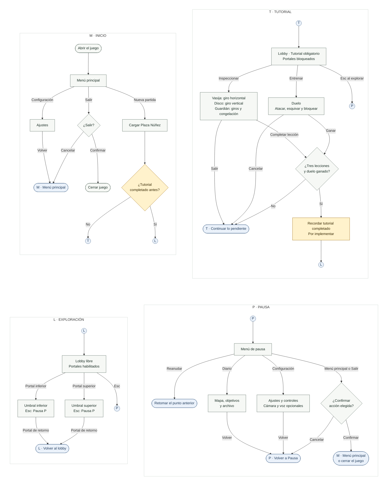

# Flujo de usuario — El asedio de Bacatá

Todo el recorrido está en un único diagrama Mermaid: inicio, tutorial obligatorio, exploración de ambos umbrales y pausa.

- [Vista previa del diagrama completo](Flujo-usuario.html).
- [Archivo Mermaid para importar](Flujo-usuario.mmd).
- [SVG](Flujo-usuario.svg) · [PNG](Flujo-usuario.png).

El archivo `.mmd` empieza directamente con `flowchart TB` y se importa completo en una sola operación. No incluye delimitadores Markdown.

## Lectura de los conectores

Los cuatro bloques forman parte del mismo diagrama. Un conector con letra continúa en el bloque con esa misma letra. Permiten mantener el recorrido completo sin flechas que atraviesen todo el lienzo.

| Letra | Destino |
| --- | --- |
| M | Menú principal. |
| T | Tutorial del lobby, con los requisitos pendientes. |
| L | Lobby libre, con los portales habilitados. |
| P | Pausa durante la exploración de cualquier zona. |

Reanudar vuelve al punto exacto donde se pausó. Salir de una inspección o cancelar un duelo lleva a T. Una defensa fallida se reintenta durante el duelo. Las tres lecciones y el duelo pueden completarse en cualquier orden.

El tutorial es obligatorio hasta completarlo por primera vez. El amarillo identifica la persistencia del tutorial entre visitas, todavía pendiente de implementación.

## Diagrama completo

## Las tres lecciones de inspección

| Pieza | Requisito |
| --- | --- |
| Vasija del eco | Giro horizontal de 28°. |
| Disco del alba | Giro vertical de 28°. |
| Guardián de jade | Ambos giros y congelación durante 0,65 s. |

## Reglas del recorrido

- Las tres inspecciones y el duelo pueden completarse en cualquier orden. Los cuatro requisitos deben cumplirse antes de habilitar los dos portales.
- El tutorial es obligatorio para acceder a los mundos; se permite pausar, consultar ayuda o abandonar. Salir de una inspección conserva su avance parcial durante la sesión. Cancelar un duelo permite intentarlo de nuevo, sin marcarlo como ganado.
- Teclado y mouse permiten completar todo el tutorial. Cámara, manos y voz son opcionales; sus ajustes y calibraciones se ofrecen desde el juego. Un fallo de dispositivo no debe impedir completar el recorrido con los controles alternativos.
- Diario también se abre con Tab y los controles con H durante la exploración. Esc en inspección sale a la plaza; en el duelo cancela el entrenamiento. Las flechas hacia Pausa corresponden al estado de exploración.
- En Configuración → Jugabilidad, Reiniciar pide confirmación y actualmente recarga la visita desde cero. Para el flujo propuesto, reiniciar una visita no debe borrar el registro de tutorial ya completado. Repetir voluntariamente las prácticas tampoco debe volver a bloquear los portales.
- Desactivar los consejos de tutorial en Configuración no equivale a completar las lecciones ni debe permitir saltarse los requisitos del primer ingreso.
- Los destinos existentes son umbrales visitables con retorno al lobby, no niveles completos. El diagrama representa ese alcance.

## Diferencia con la implementación actual

El menú, la carga de la plaza, las inspecciones, el duelo, el bloqueo de portales, los viajes de ida y vuelta y las pantallas de pausa y consulta ya existen. Actualmente el progreso del tutorial se reinicia al recargar la partida; solo los ajustes persisten.

Para que el requisito se aplique únicamente hasta la primera finalización, falta persistir el estado de tutorial completado y restaurar sus requisitos al comenzar otra visita. Los nodos amarillos representan esa ampliación propuesta. Este documento no modifica el comportamiento del juego ni añade una opción Continuar al menú.

## Referencias del proyecto

- [Diseño de la interfaz](../../DESIGN.md).
- [Lobby y tutorial](../Week08/05-Plaza-Lobby-Tutorial.md).
- [Menú de inicio](../../Assets/Nemequene/UI/Documentation/04-Menu-inicio.md).
- [Navegación de pausa y diario](../../Assets/Nemequene/UI/Scripts/MenuController.cs).
- [Requisitos y transición entre mundos](../../Assets/Prototype/Scripts/Controller/Week08/TechnicalDemoController.cs).
